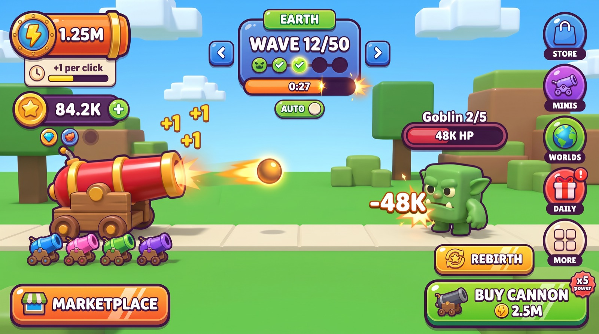

# UI Vision: Candy Arcade

Build spec for turning the chosen art direction into the real UI of "+1 Cannon Power Per Click".
Written 2 Oct 2026 against `src/client` as it was that day (other work was landing in parallel, so this doc
names functions and tables, never line numbers).

Conventions used below:

- **Design px**: every number is on the 720 px tall layout grid. On screen it is multiplied by
  `s = clamp(viewportY / 720, 0.5, 1.3)` (the existing `currentScale()` in `UI.luau`). A phone in landscape is
  `s` = 0.52 to 0.6, so 80 design px is about 44 px under a thumb and 24 design px is about 13 px of text.
- **W** = canvas width in design px: about 960 on a 4:3 tablet, 1280 on a 16:9 phone, 1560 on a 19.5:9 phone.
- **T** = height of the Roblox top bar in design px = `GuiService.TopbarInset.Height / s`. The bar is 58 real
  px, which is about 107 design px on a phone and about 54 on a tablet. "Below the top bar" always means `T + 8`.
- **Ink** = the plum outline colour `#2B1240`. Nothing in the kit is pure black.

---

## Task list

Updated 2 Oct 2026, 21:05. The order is the order of work.

| # | Task | Status |
|---|---|---|
| 1 | Kit and window shell in `UI.luau` (section 3) | Done, tested in Studio |
| 2 | HUD: cannon view and marketplace view (`Hud.luau`), prompt pills and egg sign (`Market.luau`) | Done, tested. The cannon view will be replaced by the idle-defence pivot (`docs/IDLE_DEFENSE.md`) |
| 3 | Icons: atlases A and B (32 icons) generated, cut out, uploaded and wired through `UI.icon` | Done. Images `75982409729652` and `89091306681120`, files in `assets/ui/` |
| 4 | **World look of the marketplace**: daytime lighting, cobbles, striped stalls, spotted eggs on stands, built from Roblox parts in code so it matches `ui-vision/marketplace-hud.png` | First pass done (`ui-vision/real-marketplace.jpg`): sunny sky, lawn, pale cobbles, pastel houses with coloured roofs, cream eggs with spots on gold cushions. Still to do: clouds, restyled stalls and boards, candy-style signs on the stands, the giant mini cannons' white glow |
| 5 | **Windows rebuilt to their mockups**: MINI CANNONS (card grid and detail pane), STORE (offer cards), then SHOP, MISSIONS, DAILY, WORLDS, TOP PLAYERS and the feature windows (phases 4 and 5 below) | Queued after 4 |
| 6 | More icons: sheet C (boosts, items, crates), D (world medallions), E (ammo), plus rays, glow and burst images (section 8) | Queued |
| 7 | Reward moments: hatch reveal, wave clear, coin flight (phase 6) | Queued |
| 8 | One walking HUD for plot and marketplace, with a settable travel button | Waiting for the pivot's new core to land |

---

## 1. The vision

1. Every piece on screen is a fat candy **sticker**: an ink outline, a darker lip showing under it, a gradient
   face and a white gloss streak. It should look edible and tappable to a ten year old holding a phone.
2. **One job per colour.** Lime buys and claims (one lime button per screen), orange travels, blue navigates,
   cherry closes and hurts, grape plus gold costs Robux, butterscotch is coins, cyan is gems, lemon is Cannon Power.
3. **It is a cannon game**, so the candy kit wears cannon parts: porthole rings on stat icons, barrel bands on
   the Cannon Power pill, a burning fuse for the wave timer, a muzzle flash for big moments.
4. **The lane stays empty.** The middle half of the screen (25 to 75% wide, 25 to 75% tall) holds only the
   monster, tap numbers and short-lived banners. Controls live on the edges, 80 design px or bigger.
5. **Chrome never changes, one accent does.** The same pills, panels and buttons on every world; a single
   world token (accent, panel tint, sprinkle) and a Halloween skin recolour them. Built from Frames, UICorner,
   UIStroke and UIGradient, so it works with zero uploaded art; an icon atlas layers on top later.

### The images (concept art, not screenshots)

All were generated in Kling from the style reference. Section 7 lists what each one gets wrong.

| Image | Preview | Full size | Use it for | Do not copy |
|---|---|---|---|---|
| Key art (style reference) | [preview](ui-vision/direction-candy-arcade-preview.jpg) | [png](ui-vision/direction-candy-arcade.png) | Sticker look, colours, pill shape | Layout: `+` on power, 6-orb column, giant MARKETPLACE |
| Main HUD v2 | [preview](ui-vision/hud-v2-preview.jpg) | [png](ui-vision/hud-v2.png) | The layout to build (section 4.1) | Missing gem pill, rivets, pill in the top bar |
| Egg hatch | [preview](ui-vision/egg-hatch-preview.jpg) | [png](ui-vision/egg-hatch.png) | Reveal composition, rarity banner, chips | EQUIP button (the game auto-equips), cracked shell |
| Mini Cannons window | [preview](ui-vision/mini-cannons-window-preview.jpg) | [png](ui-vision/mini-cannons-window.png) | Window shell, card grid, detail pane | Five fuse tiers (there are three), EQUIP button |
| Store window | [preview](ui-vision/store-window-preview.jpg) | [png](ui-vision/store-window.png) | Grape and gold premium cards | Coin icons on Robux prices, gem packs (not in the game yet) |
| Marketplace view | [preview](ui-vision/marketplace-hud-preview.jpg) | [png](ui-vision/marketplace-hud.png) | Slim currency row, clear bottom corners | Odds billboard (odds live in the LOOT viewer), plum orb capsule |
| Icon sheet | [preview](ui-vision/icon-sheet-preview.jpg) | [png](ui-vision/icon-sheet.png) | Icon list and style brief | The file itself: no alpha, uneven cells |
| UI kit sheet | [preview](ui-vision/ui-kit-preview.jpg) | [png](ui-vision/ui-kit.png) | Mood only | Almost everything: bleed-through, square buttons |
| Game icon | [preview](ui-vision/game-icon-preview.jpg) | [png](ui-vision/game-icon.png) | Icon direction | Cannon seen from behind, smooth goblin |
| Thumbnail | [preview](ui-vision/thumbnail-preview.jpg) | [png](ui-vision/thumbnail.png) | Thumbnail direction | Six mini cannons, small boss |

Losing directions, kept for the grafts taken from them: [Bold Toy](ui-vision/direction-bold-toy-preview.jpg),
[Cosmic Artillery](ui-vision/direction-cosmic-artillery-preview.jpg).



---

## 2. Design tokens

All tokens live in `src/client/UI.luau`. The 11 existing `UI.Colors` keys keep their names (every file reads
them) and change value; new keys are added beside them. Features get them through `ctx.UI` as today.

### 2.1 Palette

| Token | Hex | `UI.Colors` key | Used for |
|---|---|---|---|
| Ink (liquorice plum) | `#2B1240` | **new** `ink` | Every outline and text stroke; `UI.stroke` default colour (was black); dimmer |
| White | `#FFFFFF` | `white` (same) | Primary text |
| Vanilla cream | `#FFF3D6` | `text` (was 215,220,232), alias **new** `cream` | Secondary text on dark; cream wells, cards, chips |
| Cream shade | `#E9D8AE` | **new** `creamShade` | Lip under cream cards, inactive tabs |
| Lime gumdrop | `#5FE03A` | `green` | Buy, claim, go. Gradient `#8CF05A` to `#3CC926`, lip `#1C7A14` |
| Blueberry action | `#2FA8FF` | `blue` | Arrows, tabs, toggles, info. Gradient `#6CC6FF` to `#1E90F0`, lip `#1668C7` |
| Cherry | `#FF4257` | `red` | Close, NO, HP fill, boss. Gradient `#FF7483` to `#F02B45`, lip `#B81E3A` |
| Butterscotch | `#FFC61A` | `gold` | Coins, "ready" buttons, gold trim. Highlight `#FFE97A`, shade and lip `#E08A00` |
| Travel orange | `#FF8A1F` | `orange` | MARKETPLACE, BACK TO CANNON, power pill. Gradient `#FFB01F` to `#FF7A1A`, lip `#B8500A` |
| Lavender grey | `#9A93B5` | `grey` | Disabled, cannot afford. Gradient `#B4AECB` to `#8A83A8`, lip `#6A6388` |
| Blueberry panel | `#2F7BFF` | `panel` | Window and wave panel face, bottom of gradient |
| Blueberry panel top | `#4DB5FF` | **new** `panelTop` | Top of that gradient |
| Panel lip | `#1A3FA8` | **new** `panelLip` | Lip under panels |
| Well stroke | `#1F5FE0` | **new** `wellStroke` | 3 px line round the cream well |
| Grape jelly | `#5A35B0` | `row` | Stat pill top, legacy list rows, toasts |
| Grape jelly deep | `#331A6B` | **new** `pillBottom` | Stat pill bottom and lip |
| Bar track | `#3A1F55` | `dark` | Bar tracks, inset dark panels, empty pips |
| Grape soda | `#A64BFF` | **new** `premium` | Robux and game pass. Gradient `#C07BFF` to `#8F35EE`, lip `#5E1FB0`, always with a gold 3 px inner stroke |
| Lemon bolt | `#FFE23A` | **new** `power` | Cannon Power number glow, `+N` tap numbers, title tab top |
| Mint-ice cyan | `#3FE0FF` | **new** `gem` | Gems. Highlight `#C9F9FF`, shade `#1A8FE0` |
| Pumpkin / witch / slime | `#FF7A1A` / `#6B2BD9` / `#9CFF3A` | **new** `pumpkin`, `witch`, `slime` | Halloween skin only |
| Void neon | `#FF3DF0` | **new** `neon` | Keyline and sparkles on dark worlds |

Button variants are one table, `UI.Variants[name] = { top, bottom, lip, stroke? }`, with the rows above:
`primary` (lime), `secondary` (blue), `danger` (cherry), `gold`, `travel` (orange), `premium` (grape, gold
stroke), `disabled` (grey). Any other colour handed to `UI.button` is shaded by one function,
`UI.shade(color)` = `{ top = color:Lerp(white, 0.35), bottom = color, lip = color:Lerp(ink, 0.45) }`. The same
function makes rarity frames from `Config.RarityColors` and world lips from world accents, so neither needs
a second table.

Hard-coded colours to delete as their files are rebuilt: the 12 menu RGBs in `init.client.luau` and the
features, `(200,230,255)` per-click line in `Hud.luau`, `HOT` and `BLAST` in `Combat.luau`, GIVE and GET in
`Trading.luau`, `MUTED` in `Ammo.luau`, the cyan mission swatch and gold pass swatch in `Windows.luau`,
`NEUTRAL`, `MYSTERY_BACK`, `LUCK_GREEN` in `Loot.luau`.

### 2.2 Fonts

| Role | Roblox font | Size (design px) | Rules |
|---|---|---|---|
| Titles: window tabs, `WAVE 12/50`, world tab, rarity callouts, `REBIRTH`, section headers | `Enum.Font.LuckiestGuy` | 72 hero, 44 title, 30 header | All caps, white, 3 px ink stroke, plus a duplicate ink label 3 px lower as shadow on 44 and up |
| Every number: currencies, prices, HP, timers, tap and damage numbers | `Enum.Font.FredokaOne` | 46 power, 34 stat, 28 to 30 price, 40 popups | Keeps `K, M, Qa, Notg` suffix case; fixed-width box, left aligned |
| Buttons, labels, descriptions, card names | `Enum.Font.FredokaOne` (= `UI.FONT`, unchanged) | 30 primary button, 26 button, **24 floor** | White with 2 px ink stroke on colour; ink with no stroke on cream |
| Halloween event titles only | `Enum.Font.Creepster` | Same sizes as LuckiestGuy | Swapped in by the event skin, never for body text |

- Add `UI.TITLE_FONT = Enum.Font.LuckiestGuy`. Two families on screen at most (three during Halloween).
- New text uses **fixed `TextSize` under the UIScale**, not `TextScaled`, so sibling labels match.
  `TextScaled` stays only inside the legacy `UI.text` until each screen is rebuilt.
- LuckiestGuy sits low in its box: the text helper adds bottom padding of about 8% of the text size for that
  font. Measure the exact value once in Studio.
- Preload both fonts before the HUD shows (two hidden labels passed to `ContentProvider:PreloadAsync`).

### 2.3 Shape, stroke, spacing

| Token | Value (design px) | Notes |
|---|---|---|
| Radius: pill, toggle, bar, badge, orb | `UDim.new(0.5, 0)` | Capsules and circles |
| Radius: button | 22 | |
| Radius: card, cream well | 20 | |
| Radius: window, wave panel | 28 | |
| Radius: chip, name strip | 14 | |
| Outline on containers | 4, ink | 3 on cards smaller than 110 |
| Outline on text | 3 on titles, 2 on body | UIStroke child of the label |
| Well stroke | 3, `#1F5FE0` | |
| Outer keyline (HUD pieces only) | 2, cream; world accent or `#FF3DF0` on dark worlds | Keeps pills visible on the Void and on Neptune |
| Lip height | 6 buttons and cards, 5 stat pills, 8 windows | Darker frame showing under the face |
| Gloss | White at 0.7 transparency, top 38% of the face, inset 8 | Its own UICorner, because UICorner does not clip children |
| Spacing scale | 4, 8, 12, 16, 24 | Screen edge margin 16, gap between pills 8, card gap 12 |
| Window padding | 14 face to well, 12 well to content | |
| Touch target | 80 x 80 minimum hit area | A visual may be smaller (56) if its transparent hit box is 80 |
| Text floor | 24 | About 13 px on a phone |
| Tilt | Title tabs -2 degrees, pill icons -8, corner tags -8 | Nothing else rotates at rest |

**Stroke thickness must follow the scale.** `UI.stroke(thickness, color?)` registers each stroke and sets
`Thickness = max(1.5, thickness * s)`, updating on `ViewportSize` change, so a 4 px outline is 2 px on a phone
rather than twice as heavy as intended. (Check first whether a scaled `StrokeSizingMode` does this natively.)

---

## 3. Components

Everything is built from one primitive, so the look is defined once.

### 3.0 The sticker (new `UI.sticker`)

```
Root      Frame or TextButton, transparent        layout size and hit area; callers keep using this
  Keyline Frame, transparent, UICorner r, UIStroke 6 cream      HUD pieces only; shows 2 px outside the ink
  Body    Frame, transparent, centred, UIScale    the only thing that squashes on press
    Lip     Frame, lip colour, full size, UICorner r, UIStroke 4 ink (ApplyStrokeMode Border)
    Face    Frame, white + UIGradient rot 90 (top to bottom), Size (1,0,1,-lip), UICorner r
    Gloss   Frame, white 0.7 transparent, Size (1,-16,0.38,0) at (8,4), UICorner r-6
    Shine   Frame, white, same size and radius as Face, UIGradient rot 20, transparency 1 / 0.45 / 1
    Content Frame, transparent, padded; icon slot and labels
```

- No images, no 9-slice. A UIGradient multiplies the object colour, so Face and Shine are white.
- The squash UIScale is on `Body`, never on `Root`, so a press does not shift neighbours in a UIListLayout
  or UIGridLayout and never fights the shared screen-scale UIScale.
- Text is always a child label, never the TextButton's own text: a UIGradient would tint it and child frames
  would cover it.

### 3.1 Button (`UI.button`, restyled in place)

| Item | Spec |
|---|---|
| Size | 84 tall minimum for real actions (primary 96). Legacy callers keep their sizes until their screen is rebuilt |
| Build | A sticker with radius 22 and lip 6. Label: FredokaOne 26 to 30, white, 2 px ink stroke. Optional icon slot on the left (56) and price row (icon 32 plus number) |
| Variants | `primary`, `secondary`, `danger`, `gold`, `travel`, `premium`, `disabled` from `UI.Variants` |
| Normal | Face up, lip showing |
| Pressed | On touch-down: Face drops 6 onto the lip and `Body` UIScale goes to 0.94 in 0.06 s. Release: back in 0.18 s Back Out. `AutoButtonColor = false` |
| Affordable / claimable | Breathes 1 to 1.05 (1.1 s sine) and the Shine gradient's `Offset` sweeps -1 to 1 every 3 s |
| Disabled | `disabled` colours, no breathe, no shine. Still tappable: it shakes 6 px for 0.25 s and reports what is missing |
| Owned | Lime tick chip in place of the price, no lip |

**Compatibility shim (this is what lets phase 1 touch only `UI.luau`):** `UI.button(props)` still returns a
TextButton. The button's own background and text are made transparent. Two property listeners keep old code
working: a write to `.Text` is copied to the child label, and a write to `.BackgroundColor3` is looked up
(`Colors.green` to `primary`, `grey` to `disabled`, `blue` to `secondary`, `gold` to `gold`, `red` to `danger`,
`orange` to `travel`, anything else through `UI.shade`) and applied to Face and Lip. So `setButton` in
`Windows.luau` and all of `Hud.refresh` run unchanged. New code calls `UI.setButton(button, { variant, label,
icon, price, currency })` instead.

### 3.2 Panel and window (`UI.window`, restyled in place)

```
Dim gui      ScreenGui "Dim", ScreenInsets None, between HUD and windows
  Dimmer     TextButton, ink at 0.45 transparency; a tap closes the window; it is Active, so taps never fire the cannon
Windows gui  ScreenGui "Windows", above the dimmer
  frame      Frame, transparent, w x h, shared screen UIScale   <- still `window.frame`; Visible still means "open"
    Pop      Frame, centred, own UIScale for the open and close pop
      Lip    #1A3FA8, offset +8 y, radius 28, 4 px ink
      Face   white + gradient #4DB5FF to #2F7BFF, radius 28, 4 px ink
      Well   #FFF3D6, inset 14, radius 20, 3 px #1F5FE0     (opt-in, see below)
      body   Frame, transparent                              <- still `window.body`
    TitleTab pill, gradient #FFE23A to #FFB01F, 4 px ink, rotated -2, overlapping the top-left edge;
             LuckiestGuy 44 white
    Close    64 x 64 cherry sticker (radius 22) overlapping the top-right corner, 80 hit box, white cross
             drawn from two rotated rounded Frames
```

- Returns the same table: `{ frame, body, open, close, toggle, onOpen }`. `Windows.luau`, `Loot.luau` and
  four features (Backpack, Ammo, Story, Trading) read `window.frame.Visible` or listen for it changing, so
  `open()` sets it true before the pop-in and `close()` sets it false after the 0.12 s pop-out. Features
  parent only into `window.body`.
- **Phase 1 keeps the body dark.** Existing rows print cream, gold and rarity-coloured text, which is
  unreadable on cream. So by default the body sits on the blueberry face and `UI.row` stays grape. A window
  opts in to the cream well with `UI.window(title, w, h, { well = true })` when its contents are rebuilt as
  cards (phases 4 and 5).
- New options: `size = "S" | "M" | "L"` (620 x 420, 760 x 540, 900 x 600; TRADE alone is 928 x 620),
  `tabs = { ... }`, `balance = "diamonds"` (a slim currency pill in the header).
- Largest window plus its overhanging tab is 624 tall and 928 wide: fits the 960 x 720 tablet canvas.
- 14 windows use this shell: MINI CANNONS, WORLDS, SHOP, GAME PASSES, MISSIONS, DAILY REWARDS, TOP PLAYERS
  (`Windows.luau`), BACKPACK, AMMO, CRATES, INDEX, STORY, TRADE (`Features/`), LOOT (`Loot.luau`).
- `UI.row` (phase 1): grape `#5A35B0` sticker, radius 20, 3 px ink, no lip; icon becomes a 56 circle with a
  porthole ring. Same returned fields. `UI.header`: LuckiestGuy 30, white. `UI.scroll`: 10 px scrollbar in ink.
- HUD panels (`UI.panel`) stay transparent containers; the wave panel is a sticker built in `Hud.luau`.

### 3.3 Stat pill (new `UI.pill`)

| Part | Spec |
|---|---|
| Body | Sticker, capsule. Hero (Cannon Power) 300 x 72, gradient `#FFB01F` to `#FF7A1A`. Currency 250 x 60, gradient `#5A35B0` to `#331A6B`. Lip 5, keyline on |
| Icon | 76 circle (64 on currency pills) overlapping the left end by 10, tilted -8. A **porthole**: ink stroke, then a 3 px cream ring, then the disc. No rivets |
| Barrel bands | Hero pill only: one 10 px darker band (`#E0600A`) inside each end |
| Number | FredokaOne 46 hero, 34 currency, white, 3 px ink stroke, left aligned in a fixed 170 wide box so the pill never jitters |
| `+` | Coins and gems only: 48 lime circle at the right end. The whole pill is the hit box (extended to 80 tall). Coins opens STORE on the PACKS tab. Gems opens STORE on GEMS once gem packs exist; until then MISSIONS |
| Chip (hero only) | Cream chip 250 x 64, radius 14, 3 px ink, hanging 4 px under the pill: `+12 per click` in ink FredokaOne 24, then `Lv 7` and a 130 x 14 lemon mastery bar. No `+` on Cannon Power |
| Slim variant | 180 x 52, icon 48, number 28. Marketplace row and window headers |
| Fail state | `Hud.fail(currency, missing)`: pill face flashes cherry for 0.3 s and shakes; toast says `NEED 500 MORE` |

Replaces `powerLabel`, `currencyLabel`, `perClickLabel` in `Hud.luau`.

### 3.4 Progress bar (new `UI.bar`, replaces five hand-built copies)

```
Track  Frame #3A1F55, UICorner 0.5, UIStroke 4 ink
  Ghost  Frame, pale tint of the fill, inset 4, UICorner 0.5, UIGradient transparency step
  Fill   Frame, fill colour, inset 4, UICorner 0.5, UIGradient transparency step
  Gloss  white 0.75 transparent, top 40%, inset
  Label  FredokaOne, value printed on the bar
```

- **How the fill stays inside the rounded track:** Fill is always full width. Its UIGradient has a hard
  transparency step in the middle (0 until 0.5, then 1) and the value is set by `Offset.X = value - 0.5`.
  `Offset` is tweenable, so the bar glides with no squashed corners at low values and no CanvasGroup.
- Ghost uses the same trick and catches up 0.25 s later.
- `UI.bar(parent, { size, color, label })` returns `{ frame, set(value, text), setColor }`.
- Uses: monster HP (`TargetInfo` in `Effects.luau`), fuse timer, mastery, Mega Blast charge and combo drain
  (`Combat.luau`), story tracker (`Story.luau`), missions, shop limits, world progress.
- **Fuse timer** = a bar drained right to left with a spark at the tip (a 4-point star from two rotated
  rounded Frames, pulsing). Under 5 s the fill turns cherry and the bar pulses.

### 3.5 Item card with rarity frame (new `UI.card`)

```
Root      TextButton, transparent, 132 x 152, Body UIScale
  Lip     UI.shade(rarity).lip, radius 20, 4 px ink
  Face    gradient UI.shade(rarity).top to rarity colour, radius 20
  Rays    ImageLabel (rays asset, white, 0.6 transparent, own UICorner); hidden until the asset exists
  Art     110 tall: ViewportFrame of the mini cannon, or atlas icon, or code glyph
  Name    cream strip 30 tall, radius 14: `pet.short` in ink FredokaOne 24 (shrinks to 18 for long names)
  Count   `x3`, FredokaOne 24, white, ink stroke, bottom-right of the art
  Tier    36 circle in the fuse tier colour, 3 px ink, letter S, G or D, top-left, tilted -8
  Tick    36 lime circle with a code-drawn tick, top-right, when equipped
  Select  5 px lemon ring, breathing, when selected
```

- Rarity colours stay in `Config.RarityColors` (Common, Uncommon, Rare, Epic, Legendary, Exclusive, Secret,
  Mythical). The frame colours come from `UI.shade`, so text colour and frame always agree.
- Secret: the face gradient is a rainbow whose `Rotation` tweens. Mythical (Huge): double-width hero card.
- Fuse tiers are Silver, Gold, Diamond only (`Config.FuseTiers`).
- **Pictures:** move `buildMini` out of `Loot.luau` into a small shared client module (`Preview.luau`) so
  cards, the hatch reveal and the loot viewer use the same model. Keep `Loot.luau`'s rule of at most 16 live
  ViewportFrames; cards past that show a code-drawn barrel in `pet.color`. Only the selected card's preview spins.
- Cards are pooled and updated in place (the pattern in `Loot.cardAt`). `refreshPets` in `Windows.luau`
  destroys and rebuilds rows today; the card version must not, or a finger-down loses its tap.
- Hidden mini cannons: dark silhouette card, `???`, chance still printed.

### 3.6 Toggle (new `UI.toggle`)

- Visual 150 x 64 capsule, hit box 150 x 80, 4 px ink, lip 5. White 52 knob with its own ink outline.
- States for the wave toggle: **AUTO** = lime track, knob right, word on the left. **FARM** = butterscotch
  track, knob left, word on the right. Generic off = lavender grey, knob left. The knob is never the track colour.
- Knob slides in 0.15 s Back Out; track colour tweens 0.15 s.
- Locked (AUTO REBIRTH without the pass): `premium` grape with gold stroke and a lock glyph; a press offers the pass.

### 3.7 Tab (new `UI.tabs`)

- A row of pills along the top of the well, each 150 x 56 visual with an 80 hit box, FredokaOne 26.
- Active: `secondary` sticker with lip (raised). Inactive: flat `#E9D8AE`, ink text, no lip (looks pressed in).
- A tab can carry a badge. Replaces the recoloured buttons in `Crates.luau` and `Trading.luau`.

### 3.8 Badge (new `UI.badge`)

- 36 cherry circle, 3 px ink, white `!` or a count in FredokaOne 26, overlapping its host's top-right by 10.
- Bounces 6 px (0.5 s sine, there and back). `Hud.setFlags` shows or hides it instead of appending `"  !"`
  to the label.

### 3.9 Toast (`Hud.toast`, same signature)

- A grape pill sticker, 56 tall, width fitted to the text (max 720), keyline on. Icon disc 44 on the left:
  lime tick for `good`, cherry cross for `bad`, blue `i` for `info`. Text FredokaOne 26, white.
- Slot: top centre, directly under the wave cluster (y 262). One at a time, same queue rules as now (max 4,
  2.4 s hold, 1.1 s when more are waiting).
- In: slides down 20 px and pops 0.6 to 1 in 0.2 s. Out: 0.12 s pop to 0.6, then hidden. No fade is needed,
  so no CanvasGroup.
- Server-wide rare hatch announcements use the rarity colour for the pill face.

### 3.10 Floating number (`Hud.popup`, same signature, pooled)

| Kind | Look | Path |
|---|---|---|
| Tap `+N` (Cannon Power) | Lemon `#FFE23A`, FredokaOne 40, 3 px ink, small bolt glyph in front | Spawns at the finger at 1.3x, tilts up to 8 degrees, drifts 24 px toward the power pill, rises 70, 0.6 s Quad Out, fades in the last 0.25 s |
| Damage `-48K` | Cherry with white core for crits, FredokaOne 44 | At the monster. Driven by the drop in `TargetHP` between refreshes, so every mini cannon hit in a tick becomes one number |
| Coin gain | Not a number: 5 to 8 coin discs burst from the monster and arc to the coin pill | Section 5 |

- One pool of 16 labels, reused. When all 16 are busy the oldest is recycled.
- Replaces the raw TextLabel in `Hud.popup` and `burstText` in `Combat.luau` (which keeps its bigger sizes).

### 3.11 Other small pieces

- **Menu orb** (`Hud.addMenuButton`, same signature): 132 x 120 cell. An 88 circle sticker in the button's
  colour with the icon over a code-drawn fallback, and a plum label plate (30 tall, fitted to the word,
  FredokaOne 24) overlapping its bottom. Badge top-right.
- **Icon** (new `UI.icon(name, size)`): a code-drawn glyph with an ImageLabel from the atlas on top. The image
  is shown only when `IsLoaded` is true, so a slow or rejected upload never leaves a blank. With no asset ids
  set, the game ships on glyphs alone.
- **Chip**: cream, radius 14, 3 px ink, ink text 24. Used for per-click, heal rate, odds, timers.
- **Robux prices**: number plus the Robux glyph from Roblox's own fonts (`utf8.char(0xE002)`, confirm in
  Studio; plain `R$` otherwise). Never an uploaded Robux picture, never a coin icon.

---

## 4. Screens

### 4.0 Layers and canvas

| ScreenGui | Insets | Holds |
|---|---|---|
| `CombatLane` (exists, DisplayOrder -1) | None | Weak point, power orb, world-anchored bursts |
| `HUD` (exists, = `UI.gui`) | Device safe area | Everything in 4.1 and 4.2 |
| `Dim` (new) | None | Window dimmer |
| `Windows` (new) | Device safe area | All 14 windows |
| `Overlay` (new) | None | Hatch reveal, flashes, rebirth and world-clear moments |
| `Toasts` (new) | Device safe area | Toasts, so one is never hidden behind a window |

New `UI.canvas`: one frame filling the HUD gui, sized `1/s` with a UIScale of `s`, so children are positioned
in plain design px and `UI.W()` and `UI.T()` give the width and top bar height. Today each `UI.panel` scales
its own size but its anchor offsets are real pixels (the stats panel's 58, the 12 px margins), which is why
spacing drifts between devices. Legacy `UI.panel` keeps working for anything not yet moved.

### 4.1 Main HUD (cannon view)

Positions in design px. `S` = top of the left stack = `T + 8`, or 144 if that is larger and `W < 1200`
(on a tablet the stack must start below the wave arrows).

| # | Element | Where | Size | Today, and what moves |
|---|---|---|---|---|
| 1 | Wave cluster: world tab, `WAVE 12/50`, 5 pips, fuse bar, `<` `>` | Top centre, y 8 | Panel 400 x 132, arrows 80 x 80 either side (584 wide in all) | Was the bottom-centre `Wave` panel, 430 x 82 with 46 x 28 arrows. HP bar leaves it |
| 2 | AUTO / FARM toggle and `HEALS 4%/S` chip | Top centre, y 188 | 150 x 64 and 160 x 40 | Was `AUTO NEXT WAVE: ON` at the bottom of the right-hand Actions column, and half of the timer sentence |
| 3 | Toast slot | Top centre, y 262 | up to 720 x 56 | Was bare text at 176 real px |
| 4 | Cannon Power pill and per-click chip | Left 16, y `S` | 300 x 72 and 250 x 64 | Was the gold top-centre text line and a 17 px line under it |
| 5 | Coins pill | Left 16, y `S + 140` | 250 x 60 | Was half of one text string |
| 6 | Gems pill | Left 16, y `S + 208` | 250 x 60 | Same string |
| 7 | Candy pill (event only) | Left 16, y `S + 276` | 250 x 60 | Was appended to that string |
| 8 | Boost chips | Left 16, under the last pill | 60 to 96 x 52 each, 4 then `+N` | Was a sentence (`boostLabel`). Icon plus `m:ss` |
| 9 | Story tracker | `W >= 1200`: top right, x `W - 316`, y 12, 300 x 64. Narrower: under the boost chips | one line plus bar | Was a 230 x 104 box at 37.5% height on the left |
| 10 | Menu orbs | Right edge, x `W - 280` to `W - 16`, y 144 to 504 | 2 columns x 3 rows of 132 x 120 | Was a 2 x 6 grid of 112 x 36 text buttons bottom-left |
| 11 | REBIRTH and AUTO REBIRTH | Bottom right, y 512 to 596 | 196 x 84 and 112 x 84 | Were rows 2 and 3 of the Actions column (58 and 30 tall) |
| 12 | BUY CANNON | Bottom right, y 608 to 704 | 320 x 96 | Was row 1 of the Actions column |
| 13 | MEGA BLAST, combo above it | Bottom, x `W - 568` to `W - 348`, y 620 to 704; combo y 552 to 612 | 220 x 84 and 220 x 60 | Mega Blast was in the bottom-right corner; combo was under the toast in the lane |
| 14 | MARKETPLACE | Bottom left 16, y 620 | 260 x 84 | Was menu button 1 |
| 15 | First-time hint | Bottom centre, y 560 | 420 x 48 chip | Same place, now a chip with a tapping-finger glyph |
| 16 | Story dialogue | Bottom centre, y 488 to 596 | 520 x 108 | Was above the wave bar |
| 17 | Monster name and HP | BillboardGui over the monster | 280 x 76 | `TargetInfo` in `Effects.luau`, now the only HP bar |

Detail per element:

- **Wave panel** (1): a sticker whose face is the world's panel tint. World tab: 180 x 44 pill in the world
  accent, LuckiestGuy 28; tapping the tab or the title opens WORLDS. Title: LuckiestGuy 44, `WAVE 12/50`,
  or `BOSS 15/50` / `WORLD BOSS` in cherry. Pips: exactly five 30 px circles (a wave is five monsters).
  Cleared = lime with a tick, current = world accent, pulsing, upcoming = `#3A1F55` with ink outline. Boss
  waves show one wide cherry pip with a skull glyph. Fuse bar 360 x 28 straddling the bottom edge, time printed
  on it (`0:27`); before the first shot it reads `TAP TO START`. Arrows are `secondary` stickers, grey when
  `Hud.refresh` says there is nowhere to go.
- **If the cluster or the tracker does not fit inside `GuiService.TopbarInset` horizontally, it drops to
  y `T + 8`.** The left stack never sits in the top bar strip.
- **BUY CANNON** (12): the only lime button on the HUD. Icon slot with a cannon tinted
  `Config.Cannons[target].color`; line 1 `BUY CANNON`, `BUY 3 CANNONS` or `CANNON MAXED`; line 2 the star
  coin icon and the cost; a tilted cherry tag on the top-right corner `x5 POWER`. Grey when
  `Config.affordableCannon` reaches nothing.
- **REBIRTH** (11): grey with `Clear Earth 25` until ready; then `gold` with breathe and shine and
  `x3 POWER FOREVER`. AUTO REBIRTH is the toggle from 3.6 (locked style without the pass).
- **Mega Blast and combo** (13): the judge asked for a slot above the action cluster; the orb grid owns that
  space, so they sit left of BUY CANNON on the same baseline, still under the right thumb. Mega Blast is a
  sticker with a `UI.bar` charge meter; charged = `travel` orange, breathing, label `TAP!`. Combo is `x24` in
  FredokaOne 44 with a slim `UI.bar` drain, tier colours unchanged.
- **Monster HP** (17): `Goblin 2/5` (FredokaOne 28) above a 260 x 32 cherry `UI.bar` with `48K HP` on it and
  the ghost segment. The fill always matches the value. On The Sun the rim pulses.
- **Menu orbs** (10): the game registers 13 buttons (MARKETPLACE, STORE, MINI CANNONS, WORLDS, MISSIONS,
  DAILY, TOP PLAYERS, BACKPACK, AMMO, TRADE, STORY, INDEX, LOOT). Five single orbs need 600 px and the safe
  band is 360, so the grid is 2 x 3 with five cells used.

| Button (`Hud.menu` key) | Orb label | Orb colour | At the cannon | In the marketplace |
|---|---|---|---|---|
| MARKETPLACE | (travel button, not an orb) | orange | Bottom-left button, keeps its badge | hidden |
| STORE | STORE | `#2FA8FF` | Pinned | Pinned |
| MINI CANNONS | MINIS | `#A64BFF` | Pinned | Pinned |
| MISSIONS | MISSIONS | `#FF6FB5` | Pinned | Drawer (the missions board is in the square) |
| DAILY | DAILY | `#FF4257` | Pinned | Drawer (the daily chest is in the square) |
| TRADE | TRADE | `#7C8CFF` | hidden | Pinned |
| BACKPACK | BAG | `#B9783F` | Drawer | Pinned |
| WORLDS | WORLDS | `#1FC8B4` | Drawer, and the world tab opens it | Drawer |
| TOP PLAYERS | TOP | `#FFC61A` | Drawer | Drawer |
| AMMO | AMMO | `#FF6A3D` | Drawer | Drawer |
| STORY | STORY | `#3558D6` | Drawer | Drawer |
| INDEX | INDEX | `#35D8F0` | Drawer | Drawer |
| LOOT | LOOT | `#C45FD2` | Drawer | Drawer |
| (new) | MORE | cream | Fifth cell; opens the drawer | Same |

- The drawer is a cream panel of orb tiles (4 columns) that pops out beside the grid and closes on any
  outside tap. MORE carries the badge when a drawer item is flagged. A feature that calls
  `Hud.addMenuButton` lands in the drawer unless its name is in `Hud.PINNED`.
- **Touch controls:** `Effects.applyControls` already disables the control module at the cannon. Confirm in
  Studio that the jump button is gone too; if not, set `GuiService.TouchControlsEnabled = false` at the cannon
  and true in the marketplace.
- 4:3 tablets: the left stack reaches about 30% of the width. Accepted, because everything is physically
  larger there and the monster stands right of centre.

### 4.2 Marketplace HUD

Both bottom corners belong to Roblox (thumbstick left, jump right). Nothing of ours goes there.

| Element | Where | Size | Today |
|---|---|---|---|
| BACK TO CANNON | Top centre, y 8 | 340 x 96, `travel` orange, one line of label plus a sub-line `Earth · Wave 12/50` | Was a green 240 x 50 button in the bottom `Market` panel with a status sentence above it |
| Currency row | Left 16, y `max(T + 8, 112)` | Slim pills 180 x 52: power, coins, gems, candy in the event; coins and gems keep a small `+` | Was the same top-centre text block as at the cannon |
| Story tracker (small) | Under the currency row | 250 x 64 | Was 230 x 62 at 37.5% height |
| Trade request | Top centre, y 180 | 560 x 96 sticker, ACCEPT lime and NO cherry, both 80 tall | `TradeRequest` in `Trading.luau`, 470 x 60 with 44 tall buttons |
| Toast slot | Top centre, y 284 | | |
| Menu orbs | Right edge, y 176 to 536 | Same 2 x 3 grid: TRADE, MINIS, STORE, BAG, MORE | Was the 2-column text grid at right-centre |
| Egg prompt bar | Bottom centre, y 500 to 584, only at a stand | `WHAT'S INSIDE?` blue 220 x 84, `HATCH` lime 260 x 84 with the price, `HATCH x3` 240 x 84 | Stock ProximityPrompts |
| Story dialogue | Bottom centre, y 596 to 704 | 520 x 108 | Same place |

- **Egg prompt bar:** the three prompts are created in `src/server/Build.luau` / `Marketplace.luau`. Set them
  to `ProximityPromptStyle.Custom` and draw the bar in `Market.luau` from `PromptShown` / `PromptHidden`
  (keyboard players see the key cap on each button). `HATCH x3` without the pass is `premium` grape and offers it.
- **Egg stand signs** (server-built BillboardGuis): a cream card with a tab in the egg's colour, the name in
  LuckiestGuy, a price pill with the currency icon, and the `3/7 found` and luck chips that `Market.refresh`
  already writes. A lock chip in cherry when locked.
- **Odds stay in the LOOT viewer**, opened by `WHAT'S INSIDE?`. The mockup's odds billboard is not how the
  game works any more, and the viewer's list is the complete, live one Roblox's paid-random-item rules need.
  The button must keep words on it, not a bare (i).
- Stall signs, leaderboard boards and the daily chest sign use the same sticker sign.

### 4.3 Windows

All use the shell in 3.2 with `well = true` once rebuilt. Sizes: S 620 x 420, M 760 x 540, L 900 x 600.

| Window | Size | New layout | Biggest change from today |
|---|---|---|---|
| **MINI CANNONS** | L | Header chips `EQUIPPED 6/8 +` and `STORAGE 37/50 +` (the `+` opens the matching pass), `FUSE ALL` blue. Left: 4-column grid of 132 x 152 cards, strongest first, Huges as double-width Mythical hero cards carrying their `Now: +N per click` line. Right: 280 wide detail pane: large spinning preview, name strip, rarity pill, power chip, perk chips, `FUSE 3` blue button with the next tier's tag | A text list becomes a card grid. The four-line fuse legend becomes a `HOW FUSING WORKS` info chip. No EQUIP button: the game auto-equips, so the pane shows an `EQUIPPED x2` chip instead |
| **WORLDS** | L | 12 world cards, 3 columns, scrolling, opens on the player's world: planet medallion, name, twist line, `n/50` bar, boss name; button `TRAVEL` lime, `YOU ARE HERE` blue chip, or lock chip with `Clear Earth 50` | Rows become cards, progress becomes a bar, each card wears its world accent |
| **SHOP** | L | Tabs WEEKLY and HALLOWEEN (event only). One hero card for the weekly exclusive with a preview and a restock countdown chip, small cards for the fixed items, each with a `Bought 1/5` bar and a price button (gem or candy icon plus number). `SOLD OUT` is a grey stamp | Rows become a hero plus cards. Opened only from marketplace stalls, as now |
| **STORE** (title today `GAME PASSES`) | L | Tabs PASSES, PACKS (the Robux powerup bundles now listed at the bottom of BACKPACK), GEMS (hidden until gem packs exist). Grape cards with gold trim, 3 per row: icon, benefit in LuckiestGuy 30 (`x3 LUCK`), one line of text, `premium` price button 84 tall with the Robux glyph, or an `OWNED` tick chip. The dearest pass gets the hero slot and one `BEST VALUE` tag. Gem balance pill in the header | Identical gold ovals become distinct cards. No lime on this screen |
| **MISSIONS** | M | Reset countdown chip. Five cards: icon per mission, text, `UI.bar` with `350 / 1,000`, gem reward chip, button `CLAIM` (lime, breathing), reward shown greyed when not ready, tick stamp when done | Progress text becomes a bar; reward leaves the button label |
| **DAILY REWARDS** | M | Seven day cards in a row, day 7 wider with the mini cannon preview. Claimed = tick stamp and dimmed, today = lemon ring and breathe. `CLAIM DAY 3` lime 340 x 96, or a `COMES BACK IN` chip | Seven text boxes become reward cards |
| **TOP PLAYERS** | L | Tabs REBIRTHS and POWER. Rows: medal badge for ranks 1 to 3, avatar headshot, name, value. A `YOU` row pinned at the bottom in lemon | Two text blobs become ranked rows. Headshots need the user id added to the rows `Leaderboard.luau` publishes (they carry name and text only) |
| **BACKPACK** | L | Tabs by category. Card grid with count badges; detail pane with `USE` lime and a running-timer chip. `GET MORE` links to STORE, PACKS | Rows become cards; bundles move to the store |
| **AMMO** | L | Two large "loaded" cards (BIG CANNON, MINI CANNONS). Grid of ammo cards in rarity frames. Detail pane: effect, source, `LOAD BIG` and `LOAD MINI` blue, or `BUY` lime with price, or a `BOSS DROP ONLY` lock chip | Two 98 x 46 buttons per row become one detail pane |
| **CRATES** | L | Tab per crate with its count, crate picture, `BUY 1` / `BUY n` with candy prices, `OPEN 1` / `OPEN n`. `WHAT'S INSIDE?` opens the LOOT viewer on that crate (already registered there) instead of repeating the list. Opening plays a short version of the hatch reveal | Gets an opening moment; loses its duplicate odds list |
| **INDEX** | L | `FOUND 23/91` bar. HUGE CANNONS section first, then one section per egg: small cards, `???` silhouettes for hidden ones | 18 px swatches become cards |
| **STORY** | L | Left: chapter cards with a state chip. Right: chapter title tab, blurb, quest rows with `UI.bar`, reward card and `CLAIM` | Same structure, kit pieces |
| **TRADE** | 928 x 620 | PLAYERS and HISTORY tabs; player rows with real avatar headshots. Trade screen: `YOU GIVE` and `YOU GET` wells of cards, backpack grid below with x1 / x10 / ALL, `READY` lime and `CANCEL` cherry, countdown as a stamp | Hue circles become headshots, text rows become cards, `-1` tags become a tap on the card |
| **LOOT** | L | Already a card grid with 3D previews. Cards switch to `UI.card`, the header to chips, catalogue tiles to small cards | Restyle only |

Rules for every window:

- Build once, update in place. Pool cards. Never destroy rows on refresh.
- One lime button per window. Prices sit on the button with their currency icon.
- Text on cream is ink with no stroke; text on colour is white with an ink stroke.
- Scrolling lists: 12 px gaps, cards 100 px or bigger, so a drag-scroll does not hit a button.
- Optional new `UI.confirm(title, text, label, onYes)` (size S) for rebirth and for gem spends, the only
  destructive or premium actions. Nothing opens a purchase prompt by itself.

---

## 5. Motion and juice

One table, `UI.Motion`, so timings are not scattered. All are `TweenService` tweens unless noted.

| Motion | Target | Duration | Easing | Values |
|---|---|---|---|---|
| Press | `Body` UIScale, Face position | 0.06 s | Quad Out | Scale 1 to 0.94, face down 6. Fires on touch-down |
| Release | same | 0.18 s | Back Out | Back to 1 with overshoot |
| Window open | `Pop` UIScale; dimmer transparency | 0.22 s; 0.15 s | Back Out; Quad Out | 0.8 to 1; 1 to 0.45 |
| Window close | same | 0.12 s | Quad In | 1 to 0.8, then `Visible = false` |
| Tab switch, drawer | content UIScale | 0.15 s | Back Out | 0.92 to 1 |
| Slide (toast, banner) | Position | 0.2 s in, 0.12 s out | Quint Out, Quad In | 20 px |
| Stamp (claims, hatch banner, WAVE CLEAR) | UIScale and Rotation | 0.15 s | Quad In | 1.4x at -8 degrees, slams to 1x |
| Breathe (affordable, claimable) | UIScale | 1.1 s, repeats, reverses | Sine InOut | 1 to 1.05 |
| Shine sweep | UIGradient `Offset` | 0.6 s every 3 s | Linear | -1 to 1 |
| Badge bounce | Position | 0.5 s, repeats, reverses | Sine InOut | 6 px |
| Counter tick | number text (Heartbeat lerp) | 0.35 s | Quad Out | Old value to new value |
| Counter bump | pill UIScale | 0.06 s up, 0.12 s back | Quad Out, Back Out | 1 to 1.15 to 1 |
| Bar change | fill `Offset` | 0.2 s | Quad Out | Ghost follows after 0.15 s, over 0.25 s |
| Tap number | Position, UIScale, transparency | 0.6 s | Quad Out | 1.3x to 1x, rises 70 |
| Coin flight | Position | 0.15 s scatter, 0.45 s flight | Quad Out, Quad In | 5 to 8 discs to the coin pill; at most 24 in the air |
| Fail shake | Position | 0.25 s | 5 swings, decaying | 6 px |
| Flash | full-screen Frame transparency | 0.35 s | Quad Out | 0.45 to 1 |
| World change | every accent-bound colour | 0.4 s | Quad Out | Section 6 |

**Budget.** Flash, shake and long holds only for boss kills, rebirth and Legendary or better hatches. At most
16 floating numbers, 24 flying coins, 40 confetti pieces, 16 live ViewportFrames. No CanvasGroup on the HUD.
When `GuiService.ReducedMotionEnabled` is true: no loops (breathe, shine, bounce, ray spin), no shake, no
flash; pops become plain 0.1 s scale changes.

### Hatch reveal (`Effects.hatch`, same signature and the same Secret / Huge hold rules)

| Time | What happens |
|---|---|
| 0 s | `Overlay` gui dims to ink at 0.45 in 0.15 s. The egg pops in (0 to 1, Back Out 0.25 s): a code-drawn egg in `egg.color` with gradient, gloss, ink outline and three lighter spots |
| 0.25 s | Three wobbles, each bigger and faster: 8 degrees in 0.10 s, 14 in 0.08 s, 20 in 0.06 s, Sine InOut. Sound `wobble`, pitch up 10% each |
| 0.95 s | White flash (0.25 s). The egg scales to 1.4 and vanishes; 10 shell shards (rounded Frames in the egg's colour) fly out 160 px in 0.35 s |
| 1.0 s | The mini cannon pops 0 to 1.3 to 1 (Back Out 0.3 s) over rotating rays tinted to the rarity (30 degrees per second). The rarity banner stamps in. Name strip, power chip and chance chip (`0.5%` or `1 in 2,000`) slide up 0.05 s apart. `NEW!` badge pops if `Loot.found` was false |
| Hold | Common to Rare 1.2 s, Epic 1.6 s, Legendary 2.2 s with a gold screen tint, a 0.25 s shake and 24 confetti. Secret and Huge: 5 s, cannot be dismissed for 2.5 s (today's `RARE_SECONDS` and `RARE_HOLD_SECONDS`), full-screen pulse in the rarity colour, rainbow title, 40 confetti |
| End | 0.12 s pop-out. A tap anywhere skips it, except during a Secret or Huge hold |

- x3: three cards 300 px apart (today's `CARD_SPACING`), wobbling together, revealed 0.08 s apart; the rarest
  gets the bigger rays.
- A released mini cannon ("storage full") is shown dimmed with a small bin tag.
- Under the reveal: one lime `NICE!` button. `HATCH AGAIN` needs a server hatch action that does not exist
  (hatching is a ProximityPrompt), so until then the egg prompt bar stays visible under the overlay instead.

### Other moments

| Moment | Trigger the client already has | Sequence |
|---|---|---|
| Kill | `TargetIndex` rises | Current pip flips to a lime tick (pop 1.3 to 1, 0.18 s). Coins fly to the coin pill, which bumps as each lands |
| Wave clear | `Cleared` rises (compare with the last value, as `lastCoins` does) | `WAVE CLEAR` stamp in the toast slot, holds 0.6 s; pips reset with a 0.05 s stagger |
| Boss kill | Same, when `Config.waveKind` is not `normal` | Muzzle flash in the world accent, 0.3 s shake, `BOSS DOWN!` LuckiestGuy 72 stamp, 1.0 s hold, a bigger coin burst |
| World clear | Final boss cleared for the first time | Dim, rays, a `NEW WORLD UNLOCKED` card with a lime `TRAVEL` button |
| Wave failed | The `bad` toast from the server, or `Wave` dropping with the timer at 0 | Fuse bar flashes cherry, wave panel shakes |
| Timer low | `WaveEndsAt - State.now() < 5` | Fuse fill turns cherry and pulses 1 to 1.04 twice a second |
| Buy cannon | `Cannon` rises | Button stamps, power pill bumps, a `x5 POWER` number rises from the button |
| Buy fails | A press on a `disabled` button | Button shakes; that currency's pill flashes cherry and shakes; toast `NEED 500 MORE` |
| Rebirth | `Rebirths` rises | Butterscotch flash 0.2 s, `REBIRTH 3` LuckiestGuy 96 stamps, chips show `x3` to `x4 POWER`, 40 confetti, 1.2 s hold |
| Mastery level | `MasteryLevel` rises | Mastery bar fills, flashes lemon, `Lv 8` stamps on the chip |
| Daily or mission claim | State change after `claimDaily` / `claimMission` | The card stamps a tick, gem icons fly to the gem pill, the next card starts breathing |
| Mega Blast, crit, frenzy | Existing `Combat.luau` code | Keep the choreography; bursts use the kit fonts and the world accent for the flash |

### Sound hooks

There is no audio in `src` today. Add `UI.sound(name, pitch?)` and a table `UI.Sounds = { name = assetId }`;
an id of 0 is silent, so hooks can ship before any sound is chosen. Sounds play locally, with pitch varied by
4% per play so fast taps do not sound like a machine gun.

| Hook | Fired from |
|---|---|
| `tap`, `hit` | `Effects.fire`, the shot landing |
| `press`, `error` | `UI.button` press; a press on a disabled button |
| `open`, `close`, `tab` | `UI.window`, `UI.tabs` |
| `buy`, `claim`, `coin` | Cannon bought, claim stamp, each coin landing (pitch rises along the burst) |
| `wobble`, `reveal_common`, `reveal_rare`, `reveal_epic`, `reveal_legendary`, `reveal_secret` | `Effects.hatch` |
| `wave_clear`, `boss_clear`, `wave_fail`, `timer_low` | Wave moments |
| `rebirth`, `level_up` | Rebirth, mastery level |
| `combo_tier`, `mega_ready`, `mega_blast` | `Combat.luau`; combo pitch steps up 2% per tier |
| `toast` | `Hud.toast` |

---

## 6. World and event theming

One call, `UI.setWorld(index)`, tweens every accent-bound stroke and fill over 0.4 s. Components register
with `UI.bindAccent(instance, property)` when they are built. `Hud.refresh` calls it when
`Config.worldOf(State.get("Wave", 1))` changes. It is one UI with tokens, not six UIs.

**What changes:** world tab, current pip, wave panel face (the tint), story tracker header, HP bar rim, the
sprinkles on the wave panel, the HUD keyline on dark worlds, the boss-kill muzzle flash.
**What never changes:** stat pills, buttons, windows, cream wells, orbs. Muscle memory holds.

`UI.Theme.worlds[index] = { accent, tint, sprinkle, dark }`; the lip is `UI.shade(accent).lip`.

| # | World (`Config.Worlds`) | Accent | Panel tint (top to bottom) | Sprinkle (code-drawn) | Dark |
|---|---|---|---|---|---|
| 1 | Earth | `#6BD63A` | Blueberry `#4DB5FF` to `#2F7BFF` | Daisy dots | |
| 2 | Moon | `#B9A8FF` | Indigo `#7C6BFF` to `#4B3BD1` | Crater rings, small stars | |
| 3 | Mars | `#FF6A3D` | Blueberry | Dust dots | |
| 4 | Neptune | `#35D8F0` | Navy `#3558D6` to `#1F2F8F` (blueberry vanishes on ice) | Diamond flakes, a frosting drip of circles along the top | |
| 5 | The Sun | `#FFB01F` | Blueberry | Flame scallops; HP bar rim pulses | |
| 6 | The Void | `#9B3DFF` | Near-black plum `#3A1F55` to `#1E0F33` | `#FF3DF0` four-point stars | yes |
| 7 | Nebula | `#FF7AD9` | Indigo | Small stars | |
| 8 | Crystal Belt | `#4FF0C8` | Navy | Diamonds | |
| 9 | Robot Factory | `#9FB4CC` | Blueberry | Bolts (circle with a slot) | |
| 10 | Alien Jungle | `#19C98A` | Indigo | Spore dots | |
| 11 | Black Hole | `#FF8A2A` | Near-black plum | Orange ring arcs | yes |
| 12 | The Big Bang | `#FFF07A` | Blueberry | Mixed stars | |

- **Dark worlds** (`dark = true`): the ink outline disappears against a black sky, so the 2 px HUD keyline
  switches from cream to the world's neon (`#FF3DF0` in the Void, the accent in the Black Hole) and the wave
  panel gets a neon rim. This is the only case where outline colours change.
- Sprinkles are 6 to 10 small Frames placed once on the wave panel and recoloured; shapes are circles,
  rotated squares and two-Frame stars. No images.
- The WORLDS window cards use the same accents.

### Halloween (live until 1 Nov 2026, `Config.halloweenActive`)

A skin over whatever world is active: `UI.setEvent("halloween")` when `State.meta.event.active`, `nil` after.

| Piece | Normal | Halloween |
|---|---|---|
| Title tabs | Lemon to orange | Pumpkin `#FF7A1A`, Creepster |
| Window face | Blueberry | Witch purple `#8A4BEA` to `#6B2BD9` |
| Window top edge | Clean | Slime `#9CFF3A` drips: a row of circles and short rounded rects |
| Progress bars | Flat fill | Candy-corn stripes: a hard-edged ColorSequence (yellow, orange, white) on the fill |
| Sprinkles | World's own | Bats and pumpkins (code-drawn: circles plus two triangles made of rotated squares) |
| Stat stack | Power, coins, gems | Adds the candy pill (orange and purple) as the fourth pill |
| Event titles (Halloween shop tab, CRATES, event egg signs) | LuckiestGuy | Creepster |

Buttons, pills and action colours do not change: lime still means buy. Because the event is live now, this
skin is scheduled straight after the HUD (phase 3), not last.

---

## 7. Not buildable as drawn

The mockups are concept art. Roblox draws UI from rectangles, rounded corners, strokes, linear gradients,
text and uploaded images. It has no UI blur, no particles in UI, no clipping of children to rounded
corners, and no skew.

**True of every mockup**

| Drawn | Roblox reality | Substitute |
|---|---|---|
| Soft blurred shadows, inner glows, plush depth | Not from Frames | A hard lip frame and a flat gloss pill. Slightly less plush. `UIShadow` may add a soft shadow later; do not depend on it |
| Lettering with gradient, bevel and shadow in a Fredoka-like face | Text is one colour (or one gradient) plus one stroke | White text, ink UIStroke, a duplicate ink label 3 px lower. Titles become LuckiestGuy (chunkier, caps only); mixed-case names like `Goblin` use FredokaOne |
| Soft 3D-rendered icons | Cannot be drawn in code | An uploaded atlas (section 8) over a flat code-drawn glyph |
| Smooth toy cannon and goblin | Not UI. The game's monsters are plain shapes | The art oversells the 3D scene. Judge the next mockup over a real Studio screenshot |
| Dimmed, blurred world behind a window | No backdrop blur | Ink dimmer at 45%. A Lighting `BlurEffect` could blur the 3D world only, not the HUD; the dimmer must look right alone |
| Cream keyline, fixed outline weight | Stroke thickness is in pixels and does not follow UIScale | Thickness set from the scale in `UI.stroke`; keyline is a second stroked frame |

**Per mockup**

| Mockup | Cannot be built as pictured | What ships instead |
|---|---|---|
| Key art | `+` on Cannon Power (nothing to buy). Six-orb column over the full height. 500 px lime MARKETPLACE where it would cover the lane. Pill in the top bar strip. HP bar reading 62% drawn at about 45%. Mixed pip icons. Green knob on a green track | Layout of section 4.1; `UI.bar` fills always match the value; five identical pips; toggle from 3.6 |
| Main HUD v2 | No gem pill. Stack starts inside the top bar. Rivets on the porthole. A clock on the per-click chip. A bolt-in-coin on the cannon price (reads as costing power). AUTO toggle and arrows under size. MARKETPLACE 420 wide. The fuse spark's glow. Scene copied from the key art | Gem pill restored; stack at `T + 8`; double-stroke porthole; star coin on prices; 150 x 80 and 80 x 80 targets; MARKETPLACE 260 x 84; spark is two rotated Frames with no glow |
| Egg hatch | Cracked shell halves with jagged edges. Ribbon banner with forked tails. Glowing 3D gold cannon. Soft confetti. Rays in a soft disc. A blurred painterly town. `EQUIP` and `HATCH AGAIN` buttons (no such server actions). A price with an egg icon and no currency | Shell bursts into rounded shards. Banner is a rarity-coloured pill tab (a ribbon image is optional later). The mini cannon is a ViewportFrame of the in-game parts, where Neon and glow do not render. Confetti is 24 to 40 pooled rounded Frames. Rays are one rotating image with a code fallback of 8 rotated bars. One `NICE!` button |
| Mini Cannons window | Rays clipped inside rounded cards while rotating (a rotated image is not clipped). Five colours of fuse gem (three tiers exist). `EQUIP` button. 15 distinct illustrated cannons (no art for 83). Poker-chip header icons. `FUSE 3` wrapping. Inconsistent data (5 ticks for `6/8`) | Card rays are static with their own UICorner; only the detail pane's circular rays spin. Tier tags S, G, D. Pictures are ViewportFrames of the real mini cannon model, capped at 16, with a code-drawn barrel after that. One-line `FUSE 3` button. Real counts from `State.meta` |
| Store window | Diagonal `BEST VALUE` ribbons clipped to the card corner (drawn twice). Coin icons on Robux prices; gem icons on gem pack prices. Thin 45 px price pills. Gem pile, bag, chest and cart illustrations. A `2x POWER` pass and gem packs that are not in `Config` | One tilted tag that overhangs the corner. Robux glyph and number on an 84 tall grape button. Pass icons from the atlas or glyphs. Cards generated from `Config.Passes`; the GEMS tab stays hidden until packs exist |
| Marketplace view | Flat 2D illustrated world. A third-of-screen odds billboard over the stand. Odds that add up to 70%. A plum capsule round the orbs. Currency row and `BACK TO CANNON` in the top bar strip, wrapping to two lines. Stylised `E` prompt | The real blocky marketplace. Small stand sign plus the prompt bar; full odds in the LOOT viewer. No capsule: the same orb grid as the cannon view. Row at `T + 8`; one-line 340 wide button. Prompt bar from 4.2 |
| Icon sheet | Not usable as a file: no alpha channel, ink outline on a dark purple background, icons off-grid and different sizes, gem is mint not `#3FE0FF`, mini cannon has no carriage, chest glow spills out, scroll has fake text lines | Treat as a style brief. Redraw as the atlases in section 8 |
| UI kit sheet | Layout words printed as headings, reference bleed-through, smeared states, square tile buttons, list rows with folded corners, a slice of toast as the toast icon, toggles with ON / OFF text, a portrait window | Mood only. Section 3 is the kit |
| Game icon | Not built in Roblox at all: an uploaded image. The cannon is seen from behind, the carriage is missing, the goblin is far smoother than the game's monsters | Re-render once the real cannon and monster art exist: muzzle toward the viewer, `+1` as the only text |
| Thumbnail | Uploaded image. Six mini cannons (asked for four), boss the same height as the cannon, title crowding Neptune and the crown, flat side view | Re-compose over a real Studio screenshot: boss three times the cannon's height, title clear of the planets |

**Gaps that are game logic, not art** (the UI can only show a stand-in until they exist):

- Equip, unequip, equip-best and delete actions: the game auto-equips the strongest.
- A hatch action callable from a button (`HATCH AGAIN`, auto-hatch).
- Gem packs and a 2x Power pass (`DESIGN.md`: "More Robux items: Next").
- Player ids in the leaderboard rows, for avatars.
- Per-shot damage sent to the client (damage numbers are derived from `TargetHP` drops instead).
- `PolicyService` check for paid random items once gems can be bought with Robux.

---

## 8. Assets to produce next

The game runs with none of these: every icon has a code-drawn fallback. **Every upload goes through Roblox
moderation before it renders; a rejected image never loads and repeated rejections put strikes on the
account.** So: no text inside any image, nothing resembling Robux or Roblox logos, no real brands. Upload
one sheet first and wait for it to clear before sending the rest.

Format for all sheets: PNG-32, **transparent background**, 1024 x 1024, a 4 x 4 grid of 256 x 256 cells, art
kept inside the central 224 px of each cell (16 px margin so mips do not bleed), 4 px-equivalent ink outline
`#2B1240`, flat candy colours with one shade and one white highlight, 3/4 toy view. Cut with
`ImageRectOffset` / `ImageRectSize`.

| Sheet | 16 cells | Notes |
|---|---|---|
| **A. Currencies and stats** | Star coin, coin stack, gem (`#3FE0FF`), gem pile, wrapped candy, lemon bolt, rebirth arrows, mastery star, luck clover, egg (white, tinted in code), egg spots overlay, heart or heal drop, clock, lock, skull, crown | The coin is a butterscotch disc with an embossed star, nothing like Robux |
| **B. Menu and navigation** | Market stall, store bag, mini cannon (with carriage), big cannon, globe, missions scroll (no fake text lines), gift, trophy, backpack, cannonball (ammo), trade arrows, story book, index cards, treasure chest (loot), gear, tapping finger | One per orb and for the travel buttons |
| **C. Boosts, items, crates** | 2x Power, 2x Coins, 2x Luck, Mega Luck, 2x Candy, Auto Tap, Mega Damage, Heal Freeze, Supercharge, Pumpkin Crate, Cursed Crate, magnet (Coin Magnet), rapid fire, heal block shield, bin (released), info | The multiplier text is added by a TextLabel, not painted in |
| **D. Worlds** | 12 planet medallions in `Config.Worlds` order (Earth, Moon, Mars, Neptune, The Sun, The Void, Nebula, Crystal Belt, Robot Factory, Alien Jungle, Black Hole, The Big Bang), 4 spare | For WORLDS cards and the world tab |
| **E. Ammo** | Standard, Double Shot, Golden, Flame, Poison, Frost, Lucky, Boss Breaker, Candy, Void, Rainbow, 5 spare | Lowest priority: coloured circles work |

Single images:

| Image | Size | Notes |
|---|---|---|
| Rays starburst | 512 x 512, white on transparent | Tinted with `ImageColor3`. Behind hatch results and selected cards |
| Soft glow disc | 256 x 256, white radial fade on transparent | Legendary and better; boss pip |
| Burst badge | 256 x 256, white 12-point starburst on transparent | `NEW!`, `x5 POWER`; the text is a TextLabel. Fallback is a circle |
| Captain Kaboom portrait | 256 x 256, transparent | Replaces the seven-frame face in `Story.luau` |
| Boss portrait | 256 x 256, transparent, white so it can be tinted | Dialogue speaker for boss lines |
| Ribbon banner (optional) | 512 x 160, white on transparent, **9-slice** with `SliceCenter` (160, 0, 352, 160) | Only if the pill tab is not enough for hatch banners. Set `SliceScale` from the UI scale |
| Soft window shadow (optional) | 128 x 128, black fade on transparent, **9-slice** with `SliceCenter` (48, 48, 80, 80) | Only if `UIShadow` is not usable. The kit does not need it |
| Game icon | 512 x 512 (author at 1024) | Front-on firing cannon, `+1` the only text |
| Thumbnails | 1920 x 1080, at least three | Composed over real Studio screenshots |

The kit itself needs **no 9-slice images**: panels, buttons, pills, bars and cards are code-drawn. The two
9-slices above are optional polish.

Not images, but needed: about 25 short sounds for the hooks in section 5. Prefer Roblox's own Creator Store
sound effects (already cleared); uploaded audio is moderated too.

---

## 9. Build order

Each phase ends with the game fully playable. Run `tools/luau_check.py` on every file touched, then test in
Studio at 4:3, 16:9 and 19.5:9. File names are under `src/client/` unless a longer path is given.

| # | Phase | Work | Files | Game after |
|---|---|---|---|---|
| 1 | **Central restyle** | Recolour the 11 `UI.Colors` and add the new keys, `UI.Variants`, `UI.shade`, `UI.Motion`. `UI.stroke` in ink and scale-aware. `UI.button` as a sticker with the `.Text` / `.BackgroundColor3` shim and press squash. `UI.window` shell: lip, gradient face, title tab, corner close, dimmer, pop open and close, new ScreenGuis, `frame.Visible` semantics kept. `UI.row`, `UI.header`, `UI.scroll` restyled. Add `UI.sticker`, `UI.label`, `UI.pill`, `UI.bar`, `UI.card`, `UI.toggle`, `UI.tabs`, `UI.badge`, `UI.icon`, `UI.canvas`, `UI.sound` (silent). Font preload. Update the UI rows of `docs/ARCHITECTURE.md` | `src/client/UI.luau` | Same layout, every button, window and row already candy. Nothing else edited |
| 2 | **Main HUD and marketplace HUD** | Rebuild on `UI.canvas`: stat pills and chip, wave cluster with pips and fuse, AUTO toggle, action cluster, orb grid with MORE drawer and badges, travel button, toasts as pills, pooled popups, `Hud.fail`. One HP bar on `TargetInfo`. Combo and Mega Blast to their new slot on `UI.bar`. Story tracker and dialogue, trade prompt restyled and moved. Touch-control check | `Hud.luau`, `init.client.luau`, `Effects.luau`, `Features/Combat.luau`, `Features/Story.luau`, `Features/Trading.luau` | New HUD in both views; windows still phase-1 skin |
| 3 | **World and Halloween theming** | `UI.Theme.worlds`, `UI.setWorld`, `UI.bindAccent`, sprinkles, dark-world keyline, `UI.setEvent`, candy pill, slime drips, Creepster titles | `UI.luau`, `Hud.luau`, `Effects.luau` | HUD changes accent per world; event skin live before 1 Nov |
| 4 | **Core windows** | Extract `buildMini` to `Preview.luau`. Rebuild with cream wells, cards, tabs, bars: MINI CANNONS, STORE, SHOP, MISSIONS, DAILY, WORLDS, TOP PLAYERS; LOOT onto `UI.card`. Add the user id to leaderboard rows | `Windows.luau`, `Loot.luau`, new `Preview.luau`, `src/server/Leaderboard.luau` | Seven windows plus LOOT in final form |
| 5 | **Feature windows** | BACKPACK (bundles move to STORE), AMMO, CRATES, INDEX, STORY, TRADE onto cards, tabs and bars; delete their local colours and row helpers | `Features/Backpack.luau`, `Ammo.luau`, `Crates.luau`, `Huge.luau`, `Story.luau`, `Trading.luau` | Every window on the kit |
| 6 | **Reward moments and juice** | New `Fx.luau` (pooled confetti, shards, coins, flash, shake, stamp). Hatch reveal timeline. Count-up and bump counters, coin flight, damage numbers from `TargetHP`. Wave clear, boss kill, world clear, rebirth, mastery, claim moments. Reduced-motion switch | `Effects.luau`, `Hud.luau`, `Windows.luau`, `Features/Combat.luau`, `Features/Crates.luau`, new `Fx.luau` | The game feels finished without a single uploaded asset |
| 7 | **Marketplace signs and prompts** | Sticker signs on egg stands and stalls; custom prompt bar; board restyle | `src/server/Build.luau`, `src/server/Marketplace.luau`, `src/client/Market.luau` | The square matches the HUD |
| 8 | **Art and audio swap-in** | Upload sheets A and B first, then C, D, E and the single images; fill `UI.Icons` asset ids and `UI.Sounds`. Game icon and thumbnails | `UI.luau` (ids only) | Icons replace glyphs with no layout change |

### Check in Studio during phase 1, before building on it

1. Does a UIStroke's thickness follow UIScale? If it already does, drop the manual scaling in `UI.stroke`.
2. Does `UI.canvas` (frame sized `1/s` with UIScale `s`) fill the safe area exactly on phone and tablet?
3. `GuiService.TopbarInset` on a phone: real height, and how far the Roblox buttons reach from the left.
4. LuckiestGuy's vertical offset at 44 and 72; set the padding constant.
5. Does the control module's `Disable()` hide the jump button at the cannon?
6. Two UIStrokes of different thickness on overlapping frames: does the cream keyline show evenly round corners?
7. The bar's gradient step: is the edge crisp at phone scale, and does `Offset` tween smoothly?
8. `utf8.char(0xE002)` renders the Robux glyph in FredokaOne.
9. Sixteen static ViewportFrames in a scrolling grid on a low-end phone: frame time while scrolling.
